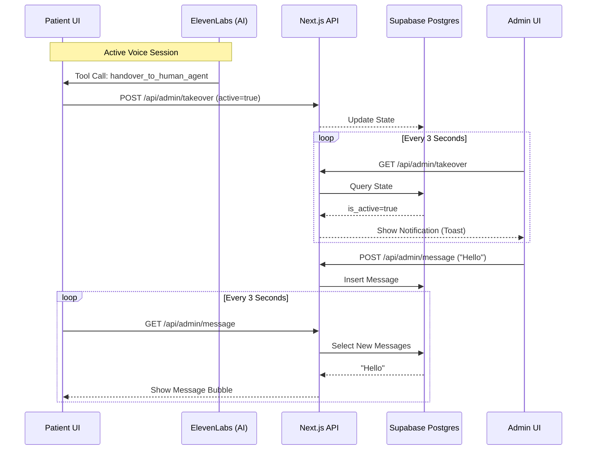
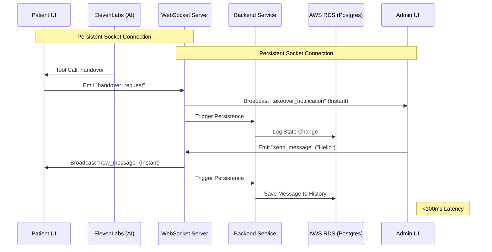

# Human Takeover: Architecture & Strategic Roadmap

This document serves as a technical overview of the human takeover logic implemented for the Nuoro Wellness AI Assistant. It covers the current Proof of Concept (POC) and the architectural path toward a high-frequency production system.

---

## 🏗️ Phase 1: Current Architecture (POC - 3s Polling)

The current implementation utilizes a **"Pull" model** where state is mediated by a Supabase PostgreSQL database.

### Technical Flow

### Analysis
| Feature | Polling (Current) |
| :--- | :--- |
| **Reliability** | **High**: Database state is the absolute source of truth. |
| **Complexity** | **Low**: Standard REST APIs; no custom socket infra. |
| **Latency** | **Medium**: ~3000ms maximum delay between messages. |
| **Cons** | **Database Pressure**: Polling creates constant read-load. |
| **Cons** | **UX**: Can feel "stuttery" compared to instant chat. |

---

## 🚀 Phase 2: Future Target (Production - Real-Time)

To move forward from POC to a production-grade system, we recommend migrating to a **"Push" model** using WebSockets and a dedicated AWS RDS instance.

### Target Flow

### Strategic Benefits of the Upgrade
1.  **Sub-100ms Latency**: Messages appear instantly, creating a premium "live" feel.
2.  **Scalability**: Offloads the "is there anything new?" overhead from the database to a lightweight socket cluster.
3.  **Battery/Data Efficiency**: Connections remain idle until data is actually pushed, which is critical for mobile patients.
4.  **RDS Isolation**: AWS RDS provides better performance tuning for massive history tables compared to a shared Supabase instance at scale.

---

## 💡 Recommended Optimizations (Bridging the Gap)
If the move to WebSockets is delayed, the current system can be optimized by:
- **Supabase Realtime**: Enabling Postgres CDC (Change Data Capture) to broadcast changes to the frontend without a custom socket server.
- **Optimistic UI**: Modifying the React state to show sent messages immediately before the DB confirmation arrives.
- **Exponential Backoff**: Slowing down polling during periods of inactivity to save compute resources.
